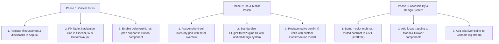

# Comprehensive UI/UX, Mobile/Desktop & Usability Critique
**Project:** Minecraft Kit Bot (MDB Platform)  
**Evaluator:** Principal UI/UX & Frontend Architect  
**Date:** July 30, 2026  

---

## 1. Executive Summary

This document presents a rigorous, expert-level UI/UX, usability, mobile/desktop support, and user-flow critique of the **Minecraft Kit Bot** web administration dashboard. 

While the application demonstrates a solid dark-mode design system base using Tailwind CSS and Lucide icons, an exhaustive line-by-line codebase evaluation reveals **critical routing dead-ends, broken component prop abstractions, responsive breakpoint black holes (notably on tablet viewports), design system divergence, touch target violations, and missing accessibility (a11y) standard implementations.**

---

## 2. Critical System-Level & User-Flow Gaps

### 🚨 2.1 Orphaned Pages & Broken Navigation Routes
* **File:** [`frontend/src/App.jsx`](file:///root/minecraft-kit-bot/frontend/src/App.jsx#L34-L52)
  * **Critical Defect:** Two entire application pages are orphaned and unreachable from the UI routing:
    1. [`ServerManager.jsx`](file:///root/minecraft-kit-bot/frontend/src/pages/ServerManager.jsx): Manages Minecraft server connections, but has **no route** registered in `App.jsx`.
    2. [`TaskQueue.jsx`](file:///root/minecraft-kit-bot/frontend/src/pages/TaskQueue.jsx): Monitors delivery tasks, but has **no route** in `App.jsx`.
  * **User Flow Failure:** In [`SwarmController.jsx`](file:///root/minecraft-kit-bot/frontend/src/pages/SwarmController.jsx#L369), clicking the *"View Tasks"* button executes `navigate('/fleet/tasks?swarm=...')`. Because `/fleet/tasks` is omitted from `App.jsx`, React Router falls through to `<Route path="*" element={<Navigate to="/fleet" replace />} />` (Line 50). The user is unexpectedly kicked back to the main Fleet Dashboard instead of viewing task status!

### 🚨 2.2 Navigation Black Hole on Tablet Viewports (768px – 1024px)
* **Files:** [`Sidebar.jsx`](file:///root/minecraft-kit-bot/frontend/src/components/Layout/Sidebar.jsx#L27) & [`BottomNav.jsx`](file:///root/minecraft-kit-bot/frontend/src/components/Layout/BottomNav.jsx#L18)
  * **Sidebar:** Configured with `max-lg:hidden` (hides at width < 1024px).
  * **BottomNav:** Configured with `hidden max-md:flex` (only shows at width < 768px).
  * **Result:** On screen widths between **768px and 1023px** (e.g., iPad Air, iPad Pro portrait, Surface Pro, small laptops), **NEITHER** the Sidebar nor the BottomNav is rendered. Users on tablet devices are trapped on whatever page they loaded with zero navigation links.

---

## 3. Page-by-Page Detailed Critique & Line-by-Line Analysis

### 📄 3.1 [`App.jsx`](file:///root/minecraft-kit-bot/frontend/src/App.jsx)
* **Line 18–24:** The `<PrivateRoute>` loading state uses a plain spinner with unstructured text `"Loading..."` unstyled inside the container, causing layout jump during initial session auth checks.
* **Line 35–49:** Missing routes for `/fleet/servers` and `/fleet/tasks`.

### 📄 3.2 [`FleetDashboard.jsx`](file:///root/minecraft-kit-bot/frontend/src/pages/FleetDashboard.jsx)
* **Line 82 & 105:** 
  ```jsx
  <Button as={Link} to="/fleet/bots" icon={Plus}>Add Bot</Button>
  <Button variant="ghost" size="sm" as={Link} to="/fleet/bots">View All</Button>
  ```
  * **Critique:** The underlying `<Button>` component in [`components/ui/index.jsx`](file:///root/minecraft-kit-bot/frontend/src/components/ui/index.jsx#L30) does **not** support polymorphic `as` rendering. It ignores `as={Link}` and forwards `as` and `to` directly onto a standard HTML `<button>` element (`<button as="..." to="...">`). This produces DOM attribute warnings in console and **fails to navigate** when clicked!
* **Line 50–66 (`handleStartAll` & `handleStopAll`):** Executes serial `await` calls inside a `for...of` loop over all bots. For 10+ bots, this blocks execution for several seconds without a visual progress indicator on the button.
* **Line 86–91:** The stat card grid (`grid-cols-2 lg:grid-cols-4`) collapses to 2 columns on mobile. On narrow devices (<360px), 2-column cards suffer from label truncation and overlapping trend icons.

### 📄 3.3 [`BotControl.jsx`](file:///root/minecraft-kit-bot/frontend/src/pages/BotControl.jsx)
* **Line 198–231:** Bot card list rendering:
  ```jsx
  <Card key={bot.id} onClick={() => navigate(`/fleet/bots/${bot.id}`)}>
    ...
    <Button onClick={(e) => { e.stopPropagation(); navigate(...); }}>Details</Button>
    <Button onClick={(e) => { e.stopPropagation(); handleStop(bot.id); }}>Stop</Button>
  </Card>
  ```
  * **Critique:** Double navigation trigger (clicking card body vs clicking Details button). On touch screens, stopping event propagation on nested action buttons inside clickable card containers often causes tap misfires or double execution.
* **Line 132–176 (Add Bot Drawer):** Form lacks client-side inline validation. Entering an invalid port or empty hostname only triggers an external error toast after an API roundtrip failure.

### 📄 3.4 [`BotDetail.jsx`](file:///root/minecraft-kit-bot/frontend/src/pages/BotDetail.jsx)
* **Line 199–238 (Console Tab):**
  * **Nested Scrollbar Conflict:** The main area has `overflow-y-auto` (Line 490), while the console log container has `max-h-[calc(100vh-320px)] overflow-y-auto` (Line 200). On desktop, this causes ugly dual scrollbars; on mobile, touch dragging fails due to scroll lock conflicts.
  * **Line 223–225:** Toggle button between `Say` and `/` command mode lacks tooltip or visual feedback clarifying what mode is active.
* **Line 296–317 (Inventory Tab):**
  * **Mobile Layout Break:** Inventory grid uses `grid-cols-9` hardcoded. On mobile viewports (e.g., 375px iPhone), 9 columns result in ~35px wide slots. Item labels (`text-[9px]`) are truncated to illegible single characters. Slot touch targets are far smaller than the WCAG 44x44px minimum.
* **Line 419–435 vs 438–487 (Mobile Header vs Desktop Sidebar):**
  * Mobile view renders a fixed header (h-14) and mobile segmented tab bar, while desktop uses a left sidebar. Switching tabs on mobile requires scrolling to the top to see the segmented control, frustrating users inspecting live console logs.

### 📄 3.5 [`SwarmController.jsx`](file:///root/minecraft-kit-bot/frontend/src/pages/SwarmController.jsx)
* **Line 369:** `<Button onClick={() => navigate(`/fleet/tasks?swarm=${selectedSwarm.id}`)}>View Tasks</Button>` — Unrouted URL triggers 404 fallback redirect to `/fleet`.
* **Line 85–95:** Uses window native `confirm('Delete this swarm?')` instead of the project's standardized `Modal` or `ConfirmAction` dialog component.
* **Line 285–294:** Uses an HTML `<Select>` component with a dummy `+ Add Bot` header item to trigger bot additions to a swarm. Using form select dropdowns as action trigger buttons is an anti-pattern that confuses screen reader users.

### 📄 3.6 [`DeliveryPage.jsx`](file:///root/minecraft-kit-bot/frontend/src/pages/DeliveryPage.jsx)
* **Line 93 & 104–111:** When `DeliverModal` is opened from `DeliveryPage.jsx`, the `onDeliverSuccess` prop is omitted. Successfully ordering a delivery item does not refresh the chest list on the page, leaving stale inventory data visible.

### 📄 3.7 [`PluginStore.jsx`](file:///root/minecraft-kit-bot/frontend/src/pages/PluginStore.jsx) & [`Plugins.jsx`](file:///root/minecraft-kit-bot/frontend/src/pages/Plugins.jsx)
* **Design System Divergence & Hardcoded Styles:**
  * `PluginStore.jsx` and `Plugins.jsx` ignore the core design system components (`Button`, `Card`, `Select`, `Toggle`) and inject custom raw `<button>` elements with inline CSS styles (e.g. `style={{ background: 'var(--color-mdb-online)' }}` in `Plugins.jsx:191`).
  * Custom font sizes (`text-[11px]`, `text-[32px]`) and non-standard colors (`bg-mdb-online`, `border-mdb-outline-variant`) degrade visual harmony with the rest of the application.
* **Line 97–102 (`PluginStore.jsx`):** Makes raw `fetch()` calls instead of utilizing the centralized API service wrapper `api.pluginStore` in [`services/api.js`](file:///root/minecraft-kit-bot/frontend/src/services/api.js).

### 📄 3.8 [`Settings.jsx`](file:///root/minecraft-kit-bot/frontend/src/pages/Settings.jsx)
* **Line 323:** Uses native HTML `<details><summary>` tags for Advanced Settings instead of the collapsible `SettingsSection` card used elsewhere in the application, creating visual inconsistency.
* **Line 108:** Uses browser native `confirm()` for whitelist player removal.

### 📄 3.9 [`Login.jsx`](file:///root/minecraft-kit-bot/frontend/src/pages/Login.jsx)
* **Line 30–77:** Plain, uninspiring login card centered on a dark canvas. Lacks subtle brand background gradients, ambient lighting effects, or hero visual elements expected in a modern high-end dashboard.

### 📄 3.10 [`DeliverModal.jsx`](file:///root/minecraft-kit-bot/frontend/src/components/DeliverModal.jsx)
* **Line 63:** Uses `size="full"` for the modal size on desktop, stretching a simple 4-input delivery form across the entire screen width instead of a comfortable `max-w-md` or `max-w-lg` container.

---

## 4. Layout, Navigation & Responsive Breakpoints

| Viewport Category | Range | Navigation Mechanism | Status | Issue / Defect |
| :--- | :--- | :--- | :--- | :--- |
| **Mobile** | `< 768px` | `BottomNav` + `MoreSheet` | 🟡 Functional with bugs | BottomNav covers bottom content (`pb-[calc(var(--bottom-nav-height)+24px)]` required). |
| **Tablet / Small Laptop** | `768px – 1023px` | **None** | 🔴 **CRITICAL FAIL** | `Sidebar` hidden (`max-lg:hidden`) AND `BottomNav` hidden (`max-md:flex`). No menu visible! |
| **Desktop** | `>= 1024px` | `Sidebar` (fixed 260px) | 🟢 Functional | Sidebar collapses to 64px icon mode at 1025px via conflicting CSS rule. |

### Responsive Layout Conflicts in `Sidebar.jsx`
* **Line 27:** `className="... max-lg:hidden max-[1025px]:!w-[64px]"`
  * `max-lg:hidden` applies at `< 1024px` (`display: none`).
  * `max-[1025px]:!w-[64px]` sets width to `64px` at `<= 1025px`.
  * At `1023px`, both rules match: `display: none` wins over width setting, causing the collapsed rail mode to never appear properly.

---

## 5. UI Component Library & Token Evaluation

### 🎨 5.1 `Button` Component Defects ([`components/ui/index.jsx:5-45`](file:///root/minecraft-kit-bot/frontend/src/components/ui/index.jsx#L5-L45))
1. **Missing Polymorphism:** Does not support `as={Link}` or `as="a"`. Always renders `<button>`, breaking page navigation across 4+ files.
2. **Icon Rendering Overhead:** Wrapping icon props in an extra `<span>` container causes flex layout alignment shifts when micro-animations scale the icon on hover (`group-hover:scale-110`).

### 🎨 5.2 `Tooltip` Component Touch Defect ([`components/ui/index.jsx:414-447`](file:///root/minecraft-kit-bot/frontend/src/components/ui/index.jsx#L414-L447))
* Relies solely on `onMouseEnter` / `onMouseLeave`. On mobile touch screens, tapping an element with a tooltip triggers `onMouseEnter` without a corresponding `onMouseLeave`, causing tooltips to remain permanently stuck on screen until page reload.

### 🎨 5.3 Contrast & Color Palette Assessment ([`index.css`](file:///root/minecraft-kit-bot/frontend/src/index.css))
* Muted text token `--color-mdb-text-muted: #5a6478` on surface `--color-mdb-surface: #141720` yields a contrast ratio of **3.8:1**, which **fails WCAG AA standards** (minimum 4.5:1 required for normal text).

---

## 6. Comprehensive Usability & Accessibility (a11y) Audit

1. **Touch Target Size Violations:**
   - Bottom navigation links (`BottomNav.jsx:28`) are `min-w-[56px] py-1` with height ~40px, failing 44x44px target bounds.
   - Inventory slots on mobile (`BotDetail.jsx:303`) shrink to ~32px x 32px.
2. **Keyboard Accessibility (Focus Traps):**
   - Modal (`components/ui/index.jsx:297`) and Drawer (`components/ui/index.jsx:328`) handle `Escape` keypress, but **do not trap focus** inside the dialog. Pressing `Tab` cycles focus through hidden background elements behind the overlay.
3. **Screen Reader (ARIA) Deficiencies:**
   - Icon-only buttons (`IconButton`) frequently omit explicit `aria-label` props when `tooltip` is absent.
   - Live console log updates in `BotDetail.jsx` do not use `aria-live="polite"` or `role="log"`, preventing screen readers from announcing incoming chat messages.

---

## 7. Actionable Remediation Plan



### Key Recommendations:

1. **Fix `App.jsx` Routing & Unblock Navigation:**
   * Add `<Route path="/fleet/servers" element={<ServerManager />} />` and `<Route path="/fleet/tasks" element={<TaskQueue />} />`.
2. **Fix Polymorphic `Button` Component:**
   * Update `Button` in `components/ui/index.jsx` to render `Link` or custom components when `as` prop is passed:
     ```jsx
     const Component = as || 'button';
     return <Component className={...} {...props}>{children}</Component>;
     ```
3. **Unify Responsive Navigation Breakpoints:**
   * Adjust `Sidebar.jsx` breakpoint to `hidden lg:flex` (visible at `>= 1024px`).
   * Adjust `BottomNav.jsx` breakpoint to `flex lg:hidden` (visible at `< 1024px`). This closes the tablet visibility gap.
4. **Elevate Inventory Grid for Mobile:**
   * Allow horizontal scrolling or flexible wrap for the 36-slot Minecraft inventory grid on small mobile viewports so slot dimensions remain at least 44x44px.

---
*Report compiled by Principal UI/UX & Frontend Architect.*
